# 质量保障体系建设方案

> 依据 2026-07 质量保障体系梳理会议要求整理(会议纪要见 `01-会议纪要-质量保障体系梳理.md`)。
> 文中标注 **【待补充】** 的地方需要各负责人用实际数据填充;"下一步计划"章节预留,由主持人统一补写。

---

## 一、背景与目标

**现状判断:大错没有,小错不断。** P0/P1 级故障已经降下来,但交付给业务的东西仍然粗糙:需求理解偏差、影响面分析缺失、测试数据不通、发布影响上下游而不自知。这些问题目前主要靠人在兜底——有人盯就没事,没人盯就出事。

**目标:从"靠人"转向"靠体系"。** 体系分两层:

1. **机制建设(框架)**——兜底能力:出了问题看得到、收得住、影响可控、持续运营;
2. **端到端流程控制点**——过程管控:在需求到发布的每个环节设置控制点,把问题拦在前面。

---

## 二、第一部分:机制建设(框架)

### 2.1 四大理念

| # | 理念 | 一句话 | 说明 |
|---|------|--------|------|
| 1 | **可观测(观测 + 预警)** | 看得到 | 问题发生后第一时间被系统发现,而不是被业务/客户发现;观测与预警一体建设 |
| 2 | **可快速恢复** | 收得住 | 快速响应机制 + 快速恢复机制,与高可用建设配套;先恢复业务,再定位根因 |
| 3 | **灰度控制影响面** | 放得慢 | 变更通过灰度逐步放量,把故障半径控制在最小范围 |
| 4 | **质量持续运营** | 管得久 | 把质量当成一个项目/虚拟组织来运作,持续度量、持续改进,而不是运动式治理 |

### 2.2 各机制建设现状

> 写法:每个机制写清楚"是什么 → 现有建设 → 覆盖情况 → 差距",不展开细节。
> 范围口径:**只盘 S 级系统**,按大领域列主要 S 级系统;A 级简单带过,在建系统不写;微服务化属基本能力,不单列。

#### 机制 1:可观测与预警

- **现有建设**:可观测管理列表已建立(质检、数仓侧维护);
- **覆盖情况**:【待补充:按 2.3 盘点表逐系统标注】
- **差距**:错误码运维推进中,当前进度与差距【待补充:推进到什么程度、差在哪里】。

#### 机制 2:快速响应 + 快速恢复(高可用)

- **现有建设**:
  - 快速响应机制:工单/值班机制运转中;
  - 快速恢复机制:在高可用建设下单独拆出,含高可用本身建设 + 快速恢复结构;
- **覆盖情况**:【待补充】
- **差距**:高可用建设尚未完成,【待补充:未完成的系统清单与卡点】。

#### 机制 3:灰度

- **现有建设**:部分系统已构建灰度能力;
- **覆盖情况**:【待补充:哪些 S 级系统已构建灰度,见 2.3 盘点表】
- **差距**:【待补充:未建灰度的 S 级系统清单】。

#### 机制 4:框架(基于平台的统一框架)

- **现有建设**:基于平台的统一框架;
- **覆盖情况**:【待补充】
- **差距**:【待补充】。

#### 机制 5:质量持续运营

- **建设思路**:质量项目化/虚拟化——固定的度量口径(P0/P1、工单量、逃逸缺陷)、固定的运营节奏(周/月质量运营会)、问题闭环跟踪;
- **现状与差距**:【待补充】。

### 2.3 S 级系统机制覆盖盘点表(模板)

> 按大领域列主要 S 级系统即可,写个大概;每格标注:✅ 已建 / 🔶 部分 / ❌ 未建。

| 领域 | S 级系统 | 可观测/预警 | 快速恢复/高可用 | 灰度 | 统一框架 | 备注 |
|------|----------|:---:|:---:|:---:|:---:|------|
| 客户市场 | 【待补充,如 1365 等】 | | | | | |
| 客服 | 【待补充】 | | | | | |
| 国际 | 【待补充】 | | | | | |
| 【其他领域】 | 【待补充】 | | | | | |

### 2.4 差距汇总

1. 高可用建设未完成:【待补充】
2. 错误码运维推进中:【待补充】
3. 灰度覆盖不全:【待补充】
4. 【待补充】

### 2.5 下一步计划

> 本章预留,由主持人统一补写。

---

## 三、第二部分:端到端流程控制点

### 3.1 端到端大图

```mermaid
flowchart LR
    subgraph P0["0 业务设计方案"]
        A0["业务方案模板<br/>(建设中·李敏)"]
    end
    subgraph P1["1 需求"]
        A1["✅ 需求评审"]
        B1["❌ 需求写不清<br/>❌ 产品考虑不足"]
    end
    subgraph P2["2 设计"]
        A2["✅ 设计评审"]
        B2["❌ 缺整体蓝图<br/>反复改、不可扩展"]
    end
    subgraph P3["3 编码(AI)"]
        A3["✅ Code Review<br/>✅ 自测要求"]
        B3["❌ 代码量大 CR 看不过来<br/>❌ 开发不懂业务、不问<br/>❌ 自测有差距"]
    end
    subgraph P4["4 测试"]
        A4["✅ SIT/业务验证"]
        B4["❌ 无产品验证<br/>❌ 账号/权限未打通<br/>❌ 基础数据缺失<br/>❌ 无全场景验证"]
    end
    subgraph P5["5 发布"]
        A5["✅ 发布/体验/业务验收流程"]
        B5["❌ 影响面识别不了<br/>❌ 管控不住"]
    end
    subgraph P6["6 运维"]
        A6["观测预警 · 快速恢复<br/>灰度 · 持续运营<br/>(四大机制承接)"]
    end
    P0 --> P1 --> P2 --> P3 --> P4 --> P5 --> P6
```

### 3.2 各阶段控制点明细(矩阵)

| 阶段 | 现有控制点 | 主要问题/差距 | 改进方向(方案) | 负责人 |
|------|-----------|--------------|----------------|--------|
| **0 业务设计方案** | 无(环节缺失) | 业务方案没做,是下游多数问题的根源 | 建立业务设计方案环节与模板 | 李敏 |
| **1 需求** | 需求评审 | 需求写不清 → 开发理解偏差、走偏;产品场景考虑不足 | 需求模板化(明确验收标准/边界场景);AI 自动化辅助另立专项 | 【待补充】 |
| **2 设计** | 内部设计评审 | 缺产品整体蓝图/未来规划,设计只满足眼前,反复修改、不可扩展(CSDP、CDD 为例) | 核心产品先补大蓝图,设计评审对照蓝图检查扩展性 | 【待补充】 |
| **3 编码** | Code Review(核心模块)、自测 | AI 编码量大 CR 看不过来;合作方开发不懂业务也不问;自测有差距 | 分级 CR(核心模块必审);自测清单化;方案已讨论 | 宏卫 |
| **4 测试** | SIT/业务验证、自测 | 不做产品验证;测试账号/权限未提前打通;基础数据缺失(OTC 最突出);无全场景验证 | 上线前**强制产品验证**;测试账号体系与基础数据**前置准备**并做成检查项 | 【待补充】 |
| **5 发布** | 发布流程(体验、业务验收) | **影响面识别不了、管控不住**——发布后影响上下游而不自知(最突出) | 发布前强制影响面分析(上下游依赖盘点),与灰度机制联动放量 | 【待补充】 |
| **6 运维** | 工单/值班、可观测列表 | 见第一部分机制差距 | 四大机制承接(见第二章) | 【待补充】 |

### 3.3 典型问题清单与阶段映射(小明已汇总)

| # | 问题 | 所属阶段 |
|---|------|---------|
| 1 | 需求理解有偏差,到编码环节就断了 | 需求 → 编码 |
| 2 | 开发缺乏业务全局视角 | 编码 |
| 3 | 改动影响面分析缺失 | 设计 / 发布 |
| 4 | SIT 环境问题多;只做业务验证,没做生产级验证 | 测试 |
| 5 | 测试人员权限不对 | 测试 |
| 6 | 产品漏测 | 测试 |
| 7 | UAT 阻塞:基础数据缺失 | 测试 |
| 8 | 体验问题 | 发布/验收 |

> 共性结论:目前靠人兜底(有人盯就没事)。凡是靠人的点,都要变成**强制的前置检查项**。

---

## 四、输出物与分工

| 事项 | 负责人 | 时间 |
|------|--------|------|
| 第一部分:机制建设(理念/覆盖/差距) | 宏卫 | 明天上午 |
| 第二部分:端到端流程控制点 + 大图 | 伟斌 | 明天上午 |
| 业务设计方案 | 李敏 | — |
| 问题清单(已汇总) | 小明 | 会前同步 |
| 下一步计划 | 主持人 | 各部分完成后 |

上午约 11 点对齐一次,过问题清单。
