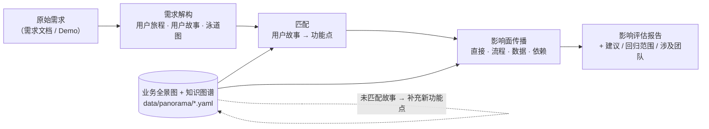

# Demand Impact Assessment（需求影响评估）

把「一个新需求进来，到底会影响什么」从靠资深同学的记忆，变成一条可运行、可沉淀的流水线：



- **业务全景图 + 知识图谱**：以 YAML「图谱即代码」维护（业务域 → 业务能力 → 功能点，
  关联系统、数据实体、触发链路），可校验、可评审、可渲染。后续需求拆解后落到功能点上，
  提前识别影响面并给出建议。→ [docs/01-业务全景图与知识图谱.md](docs/01-业务全景图与知识图谱.md)
- **需求左移解构**：从原始需求拆出用户旅程、用户故事、泳道图、术语表、假设与待澄清问题，
  一方面用于评估影响面，一方面帮助开发更好地理解需求。原始需求不只是文档 ——
  **直接给一个 demo 也可以**（走查记录进来，逆向还原需求）。
  → [docs/02-需求左移与解构.md](docs/02-需求左移与解构.md)
- **影响面分析**：故事按关键词匹配功能点，再沿知识图谱做四层影响传播，输出报告与建议。
  → [docs/03-影响面分析与建议.md](docs/03-影响面分析与建议.md)

## 快速开始

```bash
pip install -e ".[llm,dev]"     # llm 可选：只用离线模式则 pip install -e .

# 1. 校验业务全景图（示例为电商域，接入时替换 data/panorama/*.yaml）
req-insight validate

# 2. 渲染全景图总览
req-insight panorama -o examples/out/业务全景图.md

# 3a. LLM 解构 + 影响评估（需 ANTHROPIC_API_KEY 或 ant auth login）
req-insight run examples/raw/REQ-2026-001-积分抵扣.md -o report.md

# 3b. 离线模式：打印提示词 → 人工/任意模型产出 artifacts YAML → 出报告
req-insight decompose examples/raw/REQ-2026-002-demo-售后进度.md --print-prompt
req-insight run examples/raw/REQ-2026-001-积分抵扣.md \
    --artifacts examples/artifacts/REQ-2026-001.artifacts.yaml \
    -o examples/out/REQ-2026-001-影响评估报告.md
```

生成的报告长这样：[examples/out/REQ-2026-001-影响评估报告.md](examples/out/REQ-2026-001-影响评估报告.md)
（需求概要 / 用户旅程 / 故事→功能点映射 / 四层影响面 + 影响图 / 泳道图 / 建议 / 假设与待澄清）。

## 目录结构

```
data/panorama/          业务全景图（图谱即代码，示例为电商域）
  domains.yaml          业务域 → 能力 → 功能点（keywords/系统/实体/触发链路）
  systems.yaml          系统/服务 与 数据实体
src/req_insight/
  intake/               原始需求接入（文档型 / demo 型归一化）
  decompose/            需求解构（LLM 提示词 + 引擎 + 产物 YAML 存取）
  graph/                全景图加载、知识图谱、影响面传播、mermaid 渲染
  matching/             用户故事 → 功能点关键词匹配
  report/               影响评估报告（markdown）
  cli.py                req-insight 命令行
examples/               示例：原始需求（文档/demo）、解构产物、生成的报告
docs/                   方法论与数据结构说明
tests/                  pytest 用例
```

## 运行测试

```bash
python -m pytest tests/ -q
```

## Roadmap

- [ ] 匹配增强：关键词之外引入 LLM 复核 / 向量召回，减少全景图关键词维护成本
- [ ] 「疑似新功能点」自动生成全景图 YAML 补丁，评审后合入（全景图随需求生长）
- [ ] 解构产物接入图片输入（demo 截图直接喂给多模态模型，而非人工走查记录）
- [ ] 报告输出对接飞书/Confluence，评审会前自动分发
- [ ] 历史需求 → 功能点的命中记录沉淀，用于统计热点功能点与回归成本
