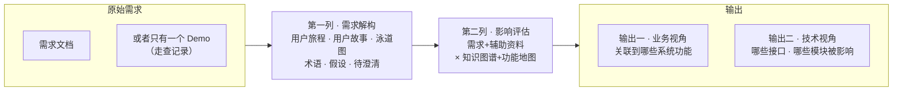
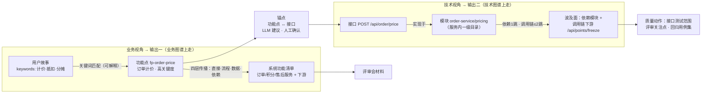
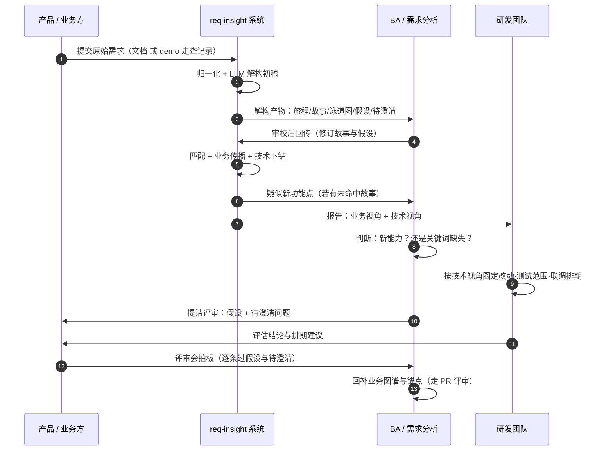

# 00 · 设计总览

> 北极星：**端到端质量提效**。需求进来后做两列评估——第一列把原始需求解构成辅助资料，
> 第二列基于「需求 + 辅助资料 + 知识图谱 + 功能地图」输出双视角影响面。
> 交互版评审材料见 [docs/design/需求影响评估-设计说明.html](design/需求影响评估-设计说明.html)。

## 一、总览：两列评估、两个输出



- 第一列的产物有两个用途：给人看（开发动手前理解需求全貌），给机器用（故事带 keywords，是第二列匹配的输入）。
- 两个输出海拔不同：业务视角给产品和评审会，技术视角给研发和测试。

## 二、第二列拆开：双视角怎么算出来



关键机制：

- **两条链都有界**：业务侧触发链 ≤3 跳、数据影响 1 跳；技术侧模块依赖 1 跳、调用链 ≤2 跳——要「值得看一眼的范围」，不是可达性闭包。
- **锚点是精度闸门**：LLM 只出候选，域 owner 签字后生效；锚错一条 = 技术视角错一片。
- **未命中 ≠ 失败**：标记疑似新功能点，评审后回补功能地图——地图靠需求生长。

## 三、功能地图

功能地图是**节点的目录**（我们有什么功能），知识图谱是**节点之间的关系**（实现/读写/触发/依赖）。

| 层级 | 数量级 | 关键字段 | 粒度判断标准 |
| --- | --- | --- | --- |
| L1 业务域 | 5~10 个 | id / name / description | 一组紧密协作团队的业务边界；一年难得变一次 |
| L2 业务能力 | 每域 1~5 个 | id / name | 用户或运营能说出口的一件「事」；季度级变化 |
| L3 功能点 | 全图百级 | id / name / keywords / implemented_by / reads·writes / triggers / criticality | **需求评审时能指着说「改它」的最小单元**：写得出 keywords、锚得到 1~3 个接口；随需求增长 |

完整示例见 [data/panorama/](../data/panorama/)（电商域：5 域 / 8 能力 / 16 功能点），
渲染：`req-insight panorama`。功能点三件套决定可用性：keywords（匹配命中率）、
implemented_by（业务视角落到系统）、锚点（技术视角下钻到接口）。

初次梳理别求全：先覆盖改动最频繁的 1~2 个域、keywords 写足，其余靠「未命中→回补」随需求补齐。

## 四、三层数据资产分工

| 层 | 养法 | 位置 | 说明 |
| --- | --- | --- | --- |
| 业务图谱 | 人工 YAML · PR 评审 | `data/panorama/`（已实现） | 业务语义机器提不出来；CI 校验引用完整性 |
| 锚点（功能点↔接口） | LLM 建议 + 域 owner 确认 | `data/anchors/`（设计中） | 全图谱唯一需长期人工投入的边；数量与接口同量级 |
| 技术图谱 | 自动提取 · 禁止手改 | `data/techmap/`(设计中) | 双源：Swagger 解析 + AI 代码图谱（LLM 扫仓库）；每条带 `source` 标记，冲突时 Swagger 优先；CI 定期重提取 |

锚点与技术图谱 schema（设计稿）：

```yaml
# data/anchors/fp-api.yaml
- fp: fp-order-price
  apis: [api-order-price]
  confirmed_by: 交易组

# data/techmap/apis.yaml（提取器生成）
apis:
- id: api-order-price
  method: POST
  path: /api/order/price
  system: svc-order            # 与业务图谱对齐
  module: mod-order-pricing
  calls: [api-points-freeze]
  source: swagger              # swagger | code-graph
modules:
- id: mod-order-pricing
  system: svc-order
  path: order-service/pricing  # 服务内一级目录/包（已拍板）
  depends_on: [mod-order-core]
  source: code-graph
```

## 五、协作泳道



系统步骤全自动（一条 `req-insight run` 跑完），人工步骤全部是评审性质。
研发第 ⑨ 步才介入，但拿到的已经是「改哪、测什么、找谁」——左移的收益。

## 六、实例（摘要）

| | 例一 REQ-2026-001 订单积分抵扣 | 例二 REQ-2026-002 售后进度可视化 |
| --- | --- | --- |
| 输入 | 需求文档 | **只有 H5 demo** 的走查记录 |
| 第一列 | 4 故事 + 旅程 + 泳道图 + 待澄清 3 条 | 逆向还原 3 故事；demo 未覆盖分支强制进待澄清 |
| 输出一 | 命中订单计价(8.0)/积分账户/退款执行，跨 6 团队 | 售后进度查询、物流跟踪；**「催一催」未命中→回补 fp-remind-merchant** |
| 输出二 | /order/price、/points/freeze、/refund/execute + pricing 模块 | /aftersale/progress、/logistics/track；催办为**新增接口**→先走接口设计评审 |
| 质量动作 | 3 接口测试范围、分摊精度评审关注、灰度+监控 | 待澄清逐条过；新接口先补锚点再开发 |

例一业务视角为真实运行输出：[examples/out/REQ-2026-001-影响评估报告.md](../examples/out/REQ-2026-001-影响评估报告.md)。

## 七、关键设计决策

| 决策 | 理由 | 代价与对策 |
| --- | --- | --- |
| 图谱用 YAML 而非图数据库 | 图谱即代码：PR 评审 + CI 校验，贴研发流程 | 超大规模再迁移，模型不变 |
| 匹配用关键词打分而非向量/LLM | 结论必须可解释，命中依据可肉眼复核 | 未命中回补兜底；LLM 复核为二道召回（Roadmap） |
| 传播有界 | 要「值得看一眼的范围」 | 跳数可配；高关键度节点单独提示 |
| 解构产物独立 YAML | 人工修订后才是需求资产，可归档重跑 | 与需求编号绑定进仓库 |
| demo 输入强制假设/待澄清显式化 | 防止把演示脑补成完整需求 | 待澄清变多正是目的 |
| **技术图谱提取源 = Swagger + AI 代码图谱（已拍板）** | 双源覆盖全部服务 | source 标记 + Swagger 优先 + CI 重提取 |
| **模块粒度 = 服务内一级目录/包（已拍板）** | 够回答「改哪」，维护量可控 | 热点模块局部下钻，不全量细化 |

## 八、实施状态与顺序

已实现（本仓库）：第一列全部、第二列业务视角、回补闭环、示例与测试。

待动工（按依赖排序）：
1. `data/techmap/` + `data/anchors/` schema 与加载校验（无外部依赖）
2. 技术侧下钻传播 + 报告技术视角章节
3. Swagger 提取器 → AI 代码图谱提取器
4. Roadmap：接口↔用例映射（回归用例集推荐）、命中记录沉淀（功能点变更热力图）
