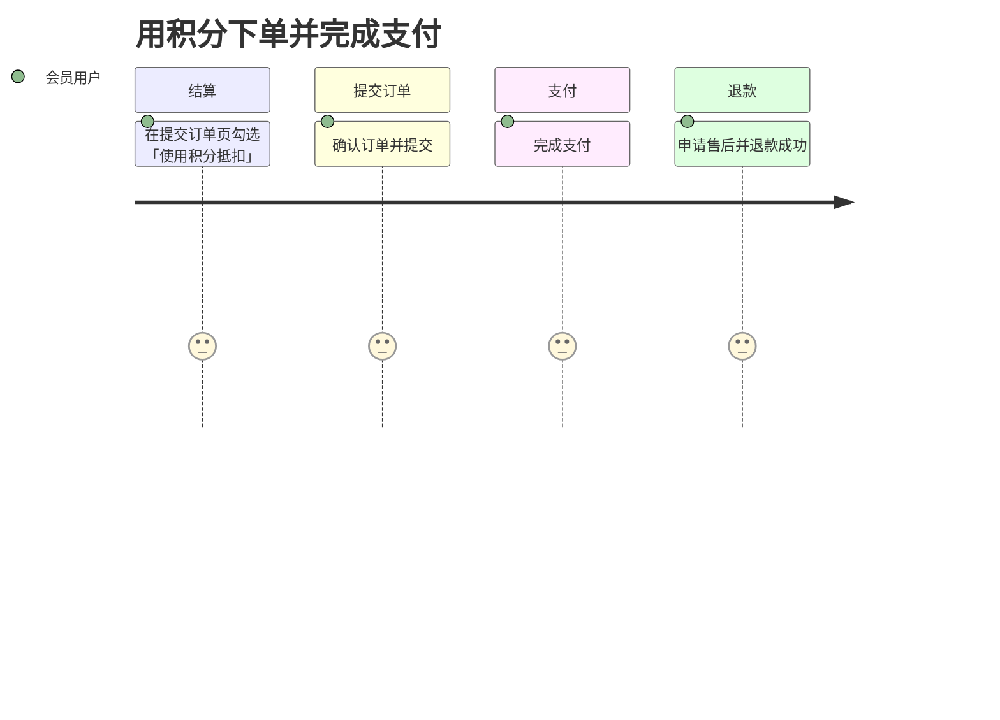
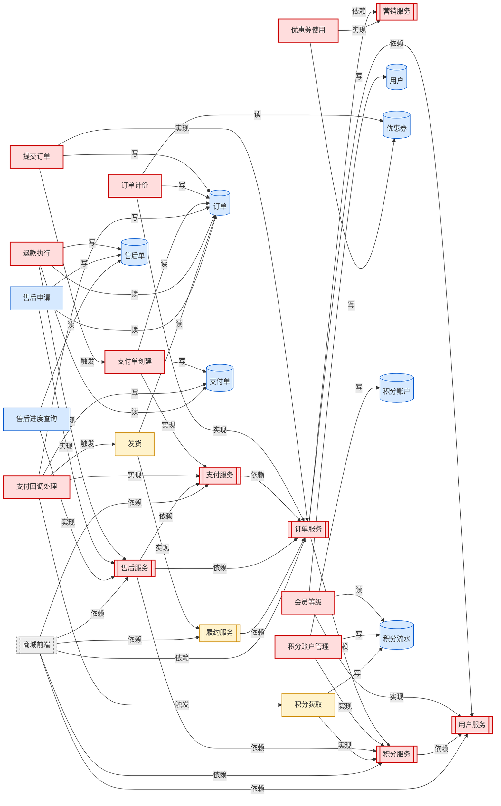
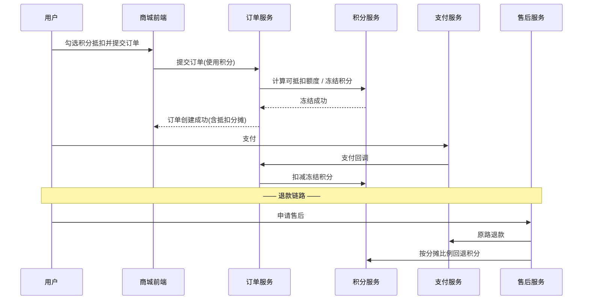

# 需求影响评估报告：订单积分抵扣

- 需求编号：`REQ-2026-001`
- 原始输入类型：需求文档

## 1. 需求概要

打通积分与交易：用户下单时可用积分按 100:1 抵扣订单金额（上限 30%），
下单冻结、支付扣减、超时解冻、退款按分摊比例回退。
核心难点在订单计价的抵扣分摊，以及退款链路的积分回退一致性。

## 2. 用户旅程

### 用积分下单并完成支付（会员用户）

| 阶段 | 用户动作 | 触点 | 系统行为 | 备注 |
| --- | --- | --- | --- | --- |
| 结算 | 在提交订单页勾选「使用积分抵扣」 | 商城前端-提交订单页 | 订单计价实时计算抵扣金额与分摊明细 | 抵扣上限为订单金额 30% |
| 提交订单 | 确认订单并提交 | 商城前端 | 创建订单，同时冻结对应积分 | 冻结失败则下单失败 |
| 支付 | 完成支付 | 收银台 | 支付回调后正式扣减冻结积分 | 超时未支付自动解冻 |
| 退款 | 申请售后并退款成功 | 商城前端-售后 | 按分摊比例回退积分到积分账户 | 回退需与原抵扣分摊一致 |

## 3. 用户故事 → 功能点映射

| 故事 | 内容 | 命中功能点 | 匹配依据 |
| --- | --- | --- | --- |
| US-1 下单页选择积分抵扣 | 作为会员用户，我希望在提交订单时选择使用积分抵扣部分金额，以便让积分产生实际价值，付更少的钱 | `fp-order-submit` 提交订单（5.5） `fp-order-price` 订单计价（2.5） `fp-member-level` 会员等级（1.0） | 提交订单、下单、提交订单、[能力] 下单 金额、抵扣、[能力] 下单 会员 |
| US-2 订单计价展示抵扣分摊 | 作为会员用户，我希望看到积分抵扣金额及其在多商品间的分摊明细，以便清楚每件商品实际支付多少 | `fp-order-price` 订单计价（8.0） `fp-pay-create` 支付单创建（1.5） `fp-coupon-apply` 优惠券使用（1.0） | 订单计价、计价、金额、优惠、抵扣、分摊 支付、[能力] 支付 满减 |
| US-3 下单冻结与支付扣减积分 | 作为平台，我希望下单时冻结积分、支付成功后扣减、超时解冻，以便防止积分超用，保证账实一致 | `fp-points-account` 积分账户管理（3.0） `fp-order-submit` 提交订单（1.5） `fp-pay-callback` 支付回调处理（1.5） | 积分、积分账户、积分冻结 下单、[能力] 下单 支付成功、[能力] 支付 |
| US-4 退款回退积分 | 作为会员用户，我希望退款时按分摊比例回退我抵扣掉的积分，以便退货不损失积分 | `fp-points-account` 积分账户管理（3.0） `fp-order-price` 订单计价（2.0） `fp-refund-money` 退款执行（2.0） | 积分、积分账户、积分回退 抵扣、分摊 退款、退积分 |

## 4. 影响面分析

### 直接影响（需求改动点）

| 对象 | 类型 | 原因 |
| --- | --- | --- |
| `fp-order-submit` 提交订单 | 功能点 | 需求直接命中 |
| `svc-order` 订单服务 | 系统 | 实现功能点「提交订单」 |
| `fp-order-price` 订单计价 | 功能点 | 需求直接命中 |
| `fp-member-level` 会员等级 | 功能点 | 需求直接命中 |
| `svc-user` 用户服务 | 系统 | 实现功能点「会员等级」 |
| `fp-pay-create` 支付单创建 | 功能点 | 需求直接命中 |
| `svc-pay` 支付服务 | 系统 | 实现功能点「支付单创建」 |
| `fp-coupon-apply` 优惠券使用 | 功能点 | 需求直接命中 |
| `svc-promo` 营销服务 | 系统 | 实现功能点「优惠券使用」 |
| `fp-points-account` 积分账户管理 | 功能点 | 需求直接命中 |
| `svc-points` 积分服务 | 系统 | 实现功能点「积分账户管理」 |
| `fp-pay-callback` 支付回调处理 | 功能点 | 需求直接命中 |
| `fp-refund-money` 退款执行 | 功能点 | 需求直接命中 |
| `svc-aftersale` 售后服务 | 系统 | 实现功能点「退款执行」 |

### 流程影响（业务链路下游）

| 对象 | 类型 | 原因 |
| --- | --- | --- |
| `fp-points-earn` 积分获取 | 功能点 | 业务流程下游：由「支付回调处理」触发（1 跳） |
| `fp-ship` 发货 | 功能点 | 业务流程下游：由「支付回调处理」触发（1 跳） |
| `svc-fulfillment` 履约服务 | 系统 | 实现下游功能点「发货」 |

### 数据影响（共享数据实体）

| 对象 | 类型 | 原因 |
| --- | --- | --- |
| `ent-order` 订单 | 数据实体 | 被「提交订单」写入，数据口径/结构可能变化 |
| `fp-ship` 发货 | 功能点 | 读取数据实体「订单」，受写入方变更影响 |
| `svc-fulfillment` 履约服务 | 系统 | 实现读方功能点「发货」 |
| `fp-refund-apply` 售后申请 | 功能点 | 读取数据实体「订单」，受写入方变更影响 |
| `ent-user` 用户 | 数据实体 | 被「会员等级」写入，数据口径/结构可能变化 |
| `ent-payment` 支付单 | 数据实体 | 被「支付单创建」写入，数据口径/结构可能变化 |
| `ent-coupon` 优惠券 | 数据实体 | 被「优惠券使用」写入，数据口径/结构可能变化 |
| `ent-points-account` 积分账户 | 数据实体 | 被「积分账户管理」写入，数据口径/结构可能变化 |
| `ent-points-flow` 积分流水 | 数据实体 | 被「积分账户管理」写入，数据口径/结构可能变化 |
| `ent-refund` 售后单 | 数据实体 | 被「退款执行」写入，数据口径/结构可能变化 |
| `fp-aftersale-progress` 售后进度查询 | 功能点 | 读取数据实体「售后单」，受写入方变更影响 |

### 依赖影响（上游调用方）

| 对象 | 类型 | 原因 |
| --- | --- | --- |
| `app-h5` 商城前端 | 系统 | 依赖受影响系统「订单服务」，接口/行为变化可能波及 |

### 涉及团队

| 团队 | 相关系统 |
| --- | --- |
| 交易组 | 订单服务、支付服务 |
| 用户组 | 用户服务 |
| 营销组 | 营销服务、积分服务 |
| 售后组 | 售后服务 |
| 履约组 | 履约服务 |
| 前端组 | 商城前端 |

## 5. 泳道图

## 6. 建议

- 回归测试范围建议覆盖功能点：提交订单、订单计价、会员等级、支付单创建、优惠券使用、积分账户管理、支付回调处理、退款执行、积分获取、发货、售后申请、售后进度查询
- 本需求跨 6 个团队（交易组、用户组、营销组、售后组、履约组、前端组），建议在需求评审时拉通对齐排期与接口契约
- ⚠ 功能点「提交订单」为高关键度（direct 影响），建议增加灰度发布/开关与线上监控告警
- ⚠ 功能点「订单计价」为高关键度（direct 影响），建议增加灰度发布/开关与线上监控告警
- ⚠ 功能点「积分账户管理」为高关键度（direct 影响），建议增加灰度发布/开关与线上监控告警
- ⚠ 功能点「支付回调处理」为高关键度（direct 影响），建议增加灰度发布/开关与线上监控告警
- ⚠ 功能点「退款执行」为高关键度（direct 影响），建议增加灰度发布/开关与线上监控告警
- 涉及数据实体变更（订单、用户、支付单、优惠券、积分账户、积分流水、售后单），建议评估存量数据兼容、报表/下游消费口径，并确认是否需要数据订正
- 业务流程下游（积分获取、发货）虽非本需求改动目标，建议至少做冒烟验证，确认触发链路无回归

## 附：术语表

| 术语 | 解释 |
| --- | --- |
| 抵扣分摊 | 积分抵扣总金额按商品实付金额比例分摊到各订单行 |
| 冻结 | 下单占用但未扣减的积分状态，支付成功后转为扣减 |

## 附：假设（需评审确认）

- 积分抵扣与优惠券可叠加使用，抵扣在券后金额基础上计算
- 回退积分不受积分有效期影响（过期积分退款仍回退）

## 附：待澄清问题

- [ ] 部分发货后仅退部分商品，积分回退按行分摊还是按比例？
- [ ] 积分抵扣金额是否参与会员成长值计算？
- [ ] 冻结积分在积分明细页如何展示？
