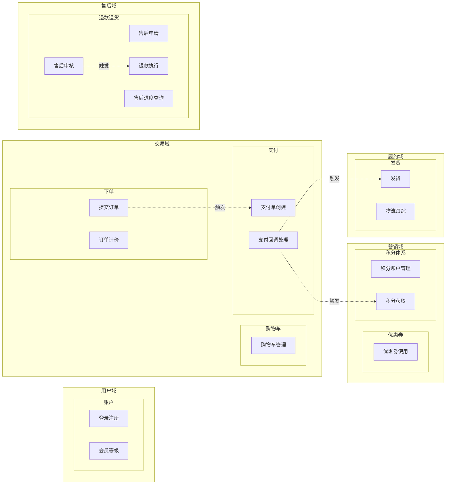

# 业务全景图

```mermaid
flowchart LR
  subgraph dom_user["用户域"]
    subgraph cap_account["账户"]
      fp_login["登录注册"]
      fp_member_level["会员等级"]
    end
  end
  subgraph dom_marketing["营销域"]
    subgraph cap_coupon["优惠券"]
      fp_coupon_apply["优惠券使用"]
    end
    subgraph cap_points["积分体系"]
      fp_points_account["积分账户管理"]
      fp_points_earn["积分获取"]
    end
  end
  subgraph dom_trade["交易域"]
    subgraph cap_cart["购物车"]
      fp_cart["购物车管理"]
    end
    subgraph cap_order["下单"]
      fp_order_submit["提交订单"]
      fp_order_price["订单计价"]
    end
    subgraph cap_pay["支付"]
      fp_pay_create["支付单创建"]
      fp_pay_callback["支付回调处理"]
    end
  end
  subgraph dom_fulfillment["履约域"]
    subgraph cap_delivery["发货"]
      fp_ship["发货"]
      fp_logistics_track["物流跟踪"]
    end
  end
  subgraph dom_aftersale["售后域"]
    subgraph cap_refund["退款退货"]
      fp_refund_apply["售后申请"]
      fp_refund_audit["售后审核"]
      fp_refund_money["退款执行"]
      fp_aftersale_progress["售后进度查询"]
    end
  end
  fp_order_submit -.->|触发| fp_pay_create
  fp_pay_callback -.->|触发| fp_points_earn
  fp_pay_callback -.->|触发| fp_ship
  fp_refund_audit -.->|触发| fp_refund_money
```
